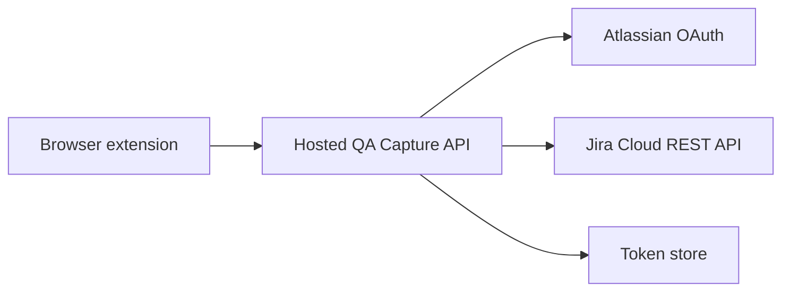

# Hosted Jira OAuth Architecture

This document captures the migration path from the local Jira connector to a hosted OAuth/token broker. The goal is to remove the need for each user to run `server.js` locally while keeping Atlassian secrets out of the browser extension.

## Why A Hosted Service Is Needed

Atlassian OAuth 2.0 for Jira Cloud requires a `client_secret` when exchanging an authorization code for tokens and when refreshing tokens. A browser extension cannot safely store that secret, so a backend service must own:

- Atlassian OAuth client secret
- Authorization code exchange
- Refresh-token rotation
- Token persistence
- Jira Cloud REST API calls

The extension should only talk to the hosted QA Capture API.

## Target Shape

## Hosted API Endpoints

The hosted service can keep the same endpoint shape as the current local connector:

- `GET /`
- `GET /health`
- `POST /auth/session`
- `GET /auth/start`
- `GET /auth/callback`
- `GET /auth/status`
- `POST /auth/disconnect`
- `POST /jira/create`
- `GET /jira/project-meta`
- `GET /jira/projects`
- `GET /jira/issues`
- `GET /jira/assignable-users`

This keeps the extension migration small: the `Connector URL` changes from `http://127.0.0.1:8787` to the hosted API URL.

## OAuth Flow

1. User clicks `Connect Jira` in the extension.
2. Extension requests a broker session token from `POST /auth/session`.
3. Extension stores that opaque session token locally.
4. Extension opens `https://qa-capture-api.example.com/auth/start?session=...`.
5. Hosted API redirects to Atlassian OAuth.
6. Atlassian redirects to `https://qa-capture-api.example.com/auth/callback`.
7. Hosted API exchanges the authorization code using the server-side client secret.
8. Hosted API calls Atlassian `accessible-resources` to identify Jira sites and cloud IDs.
9. Hosted API stores encrypted token data against the broker session.
10. Extension calls the hosted API with `X-QA-Capture-Session` for Jira issue creation and metadata searches.

## Token Storage

Replace local `oauth-tokens.json` with a database table.

Suggested fields:

- `id`
- `atlassian_account_id`
- `display_name`
- `email`
- `cloud_id`
- `site_url`
- `access_token_encrypted`
- `refresh_token_encrypted`
- `expires_at`
- `created_at`
- `updated_at`
- `disconnected_at`

Refresh tokens rotate, so the service must overwrite the stored refresh token whenever Atlassian returns a new one.

## Extension Changes

The extension should:

- Default `Connector URL` to the hosted API URL.
- Keep local connector support as a development fallback.
- Use `Connect Jira` to open hosted `/auth/start`.
- Use `/auth/status` to display connected/disconnected state.
- Continue sending the same Jira payload shape to `/jira/create`.

## Security Requirements

Before production use, the hosted service should include:

- Environment variables for Atlassian client ID and secret.
- Encrypted token storage.
- Strict CORS allowlist for the browser extension origin.
- OAuth `state` validation.
- Session or extension-user identity handling.
- Request body limits for screenshots and attachments.
- Audit logging for issue creation.
- Explicit disconnect/revoke behavior.

## Recommended Implementation Phases

1. **Service scaffold**
   Create a deployable service that mirrors the local connector routes and reads config from environment variables.

2. **Database token store**
   Replace `oauth-tokens.json` with persistent encrypted storage.

3. **Extension migration**
   Point the extension at the hosted service while keeping the local connector URL configurable.

4. **User/session model**
   Add a simple identity layer so the hosted service can associate Jira tokens with a specific user.

5. **Production hardening**
   Add CORS restrictions, token encryption, request limits, logging, and deployment docs.

## Open Decisions

- Hosting provider: Azure, AWS, Cloudflare, Vercel, Render, or internal infrastructure.
- Database: Postgres is the likely default.
- Identity model: Atlassian-only identity vs separate QA Capture user accounts.
- Whether screenshots should pass through the hosted service or be uploaded directly through a short-lived upload flow.
- Whether this remains internal-only or becomes distributable to other teams.
